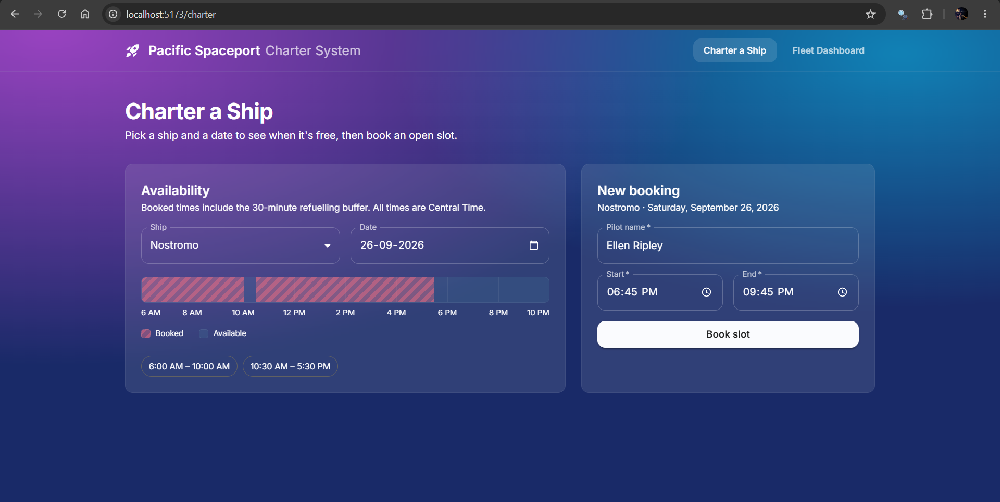
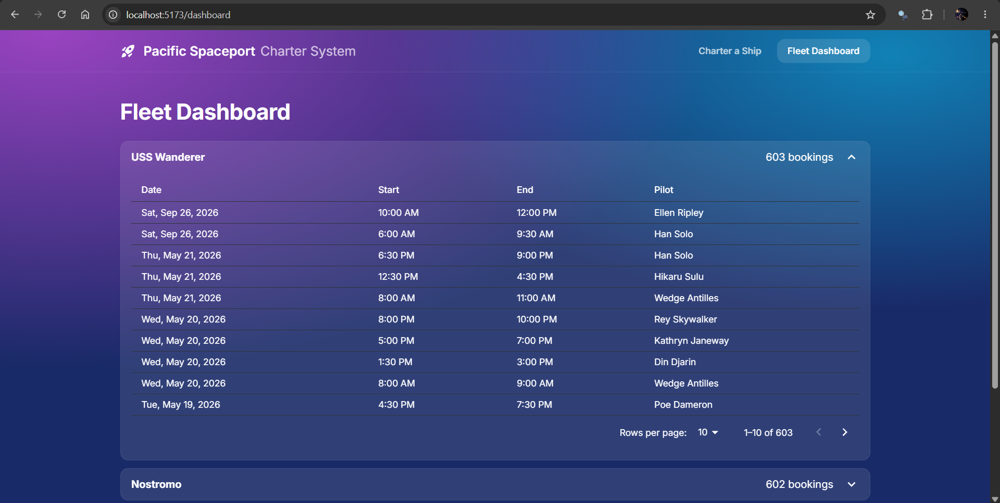

# Pacific Spaceport Charter System

A small full-stack app for booking charter ships at the Pacific Spaceport. Dispatchers pick a ship and a date, see when it's unavailable, and book an open slot. Fleet managers see every booking, grouped by ship.

The original brief is in [ASSIGNMENT.md](ASSIGNMENT.md).

## Screenshots

**Charter a Ship**: choose a ship and a date, check the timeline, book a slot.



**Fleet Dashboard**: all bookings grouped by ship, newest first, paginated.



## Booking rules

These are enforced by the backend on every new booking:

- **No overlaps**: two bookings on the same ship can't overlap.
- **Refuelling buffer**: consecutive bookings on the same ship need at least 30 minutes between them.
- **Operating hours**: bookings must fall entirely between 6:00 AM and 10:00 PM Central Time, and can't cross midnight. Daylight saving is handled.

Different ships can be booked at the same time.

## Tech stack

- **Backend**: Python 3.13, Django 6, Django REST Framework
- **Database**: PostgreSQL
- **Frontend**: React 19, TypeScript, Vite, Material UI, React Router, axios

## Running locally

You'll need Python 3.13+, Node.js 22+ and PostgreSQL.

### 1. Database

Create a database and a user that owns it:

```sql
CREATE USER spaceportadmin WITH PASSWORD 'your-password';
CREATE DATABASE spaceport OWNER spaceportadmin;
```

### 2. Backend

From the project root:

```bash
python -m venv venv
venv\Scripts\activate          # macOS/Linux: source venv/bin/activate
pip install -r requirements.txt
```

Create `backend/.env` with a Django secret key and your database details:

```
DJANGO_SECRET_KEY=your-secret-key
DATABASE_NAME=spaceport
DATABASE_ADMIN=spaceportadmin
DATABASE_ADMIN_PASSWORD=your-password
DATABASE_HOST=localhost
DATABASE_PORT=5432
```

To generate a secret key (with the venv activated):

```bash
python -c "from django.core.management.utils import get_random_secret_key; print(get_random_secret_key())"
```

If `DJANGO_SECRET_KEY` is missing, the app falls back to an insecure development key. That's fine for running locally, but never use it in production.

Create the tables, load the seed data and start the server:

```bash
cd backend
python manage.py migrate
python manage.py shell -c "from charters.utils.run_seeder import seed_db; seed_db('charters/utils/seed.json')"
python manage.py runserver
```

The API runs at http://127.0.0.1:8000/api/.

> **Seeding replaces all existing ships and bookings.** To generate fresh seed data (dates are relative to today), run from the project root:
> - PowerShell: `python seed.py | Out-File -Encoding utf8 backend/charters/utils/seed.json`
> - macOS/Linux: `python seed.py > backend/charters/utils/seed.json`

### 3. Frontend

In a second terminal:

```bash
cd frontend
npm install
npm run dev
```

Open http://localhost:5173.

## API

| Method | Endpoint | Description |
|---|---|---|
| GET | `/api/ships/` | All ships, with a booking count for each |
| GET | `/api/ships/<id>/` | One ship |
| GET | `/api/availability/?ship=<id>&date=YYYY-MM-DD` | Unavailable times for a ship on a date, including the 30-minute buffer |
| GET | `/api/bookings/?ship=<id>&page=<n>&page_size=<n>` | Bookings, newest first, paginated. `ship` is optional |
| POST | `/api/bookings/` | Create a booking. Returns 201, or 400 with the rule that failed |
| GET | `/api/bookings/<id>/` | One booking |

Example booking request:

```json
{
  "ship": 1,
  "pilot_name": "Ellen Ripley",
  "start_time": "2026-09-26T10:00",
  "end_time": "2026-09-26T12:00"
}
```

Times without an offset are read as **Central Time**. Times with an offset (`-05:00`) or `Z` also work.

## Notes

- **Field names** use Python's `snake_case` (`pilot_name`, `start_time`) instead of the brief's `camelCase` (`pilotName`, `startTime`).
- **Unavailable times are computed on the backend.** The frontend only draws what `/api/availability/` returns.
- **Known limitation:** two identical booking requests sent at exactly the same moment could both pass validation. A database-level exclusion constraint or row locking would close this gap.

## Project structure

```
├── backend/
│   ├── spaceport/        Django settings and root URLs
│   └── charters/         Models, serializers, views, seeder
├── frontend/
│   └── src/
│       ├── pages/        Charter a Ship, Fleet Dashboard
│       ├── components/   Timeline, bookings table, card
│       └── api.ts        All calls to the backend
├── seed.py               Seed data generator
└── requirements.txt
```
